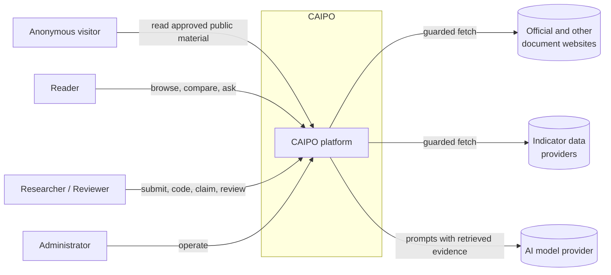

# Architecture

Status: Draft for owner review · Last updated: 2026-10-02

This document describes the target architecture. Only the Phase 1 skeleton is implemented: the Django project, the User foundation in `accounts`, the access-declaration rule and health endpoints in `web`, and correlation IDs and JSON log formatting in `core`. The readiness endpoint checks the database only. Decisions are recorded in [adr/](adr/README.md). ADR-0001, 0002, 0005, 0007, 0009, and 0010 are Accepted; the others are Proposed and must not be built on. Where this document and an Accepted ADR differ, the ADR governs.

## 1. System context



People:

- **Anonymous visitors** read approved, public material on the public research site. They have no account and can do nothing else.
- **Readers** are authenticated accounts that browse approved content in the research workspace and ask the assistant questions.
- **Researchers and Reviewers** build the evidence base.
- **Administrators** operate the system.

External systems, all untrusted or outside our control:

- **Document websites**: government portals, legal databases, international organisations, publishers.
- **Indicator data providers**: statistical agencies and international organisations.
- **AI model provider**: text generation, and possibly embeddings and reranking.

## 2. Major components

CAIPO is one Django project made of apps with enforced boundaries ([ADR-0001](adr/0001-modular-monolith.md)).

### 2.1 Apps and layers

An app may import only from apps in lower layers. Apps in the same layer do not import each other. Foreign keys point only to lower layers.

| Layer | App | Responsibility |
|---|---|---|
| 0 | `core` | Shared base classes, identifiers, correlation IDs. No domain knowledge and no reference to users. |
| 1 | `accounts` | Users, roles, permissions, audit events, redaction records |
| 1 | `registry` | Countries, institutions, languages |
| 2 | `sources` | Sources, documents, versions, artifacts, acquisition records, reviews, rights, extractions, segments, passages |
| 3 | `ingestion` | Ingestion requests and their lifecycle; orchestration of guarded fetch, upload intake, and parsing; validation of output from the isolated workers. The untrusted-input boundary. Writes through `sources` services. |
| 4 | `indicators` | Indicators, series, dataset releases, observations. Obtains dataset files through `ingestion`. |
| 4 | `policies` | Policies, objectives, instruments, sectors, formal policy events, relations |
| 5 | `research` | Claims, evidence, reviews, analysis runs, search runs |
| 6 | `retrieval` | Retrieval chunks, embeddings, lexical and vector search over eligible segments |
| 7 | `assistant` | Question answering pipeline, provider interface, interaction log |
| 8 | `evaluation` | Evaluation datasets, runs, results |
| 8 | `web` | Pages, forms, and any HTTP API. Contains no business logic. |

Audit events and redaction records refer to their targets by type and public identifier, not by foreign key, so that `accounts` does not depend on higher layers.

Twelve apps is the upper bound of what is justified. If two apps turn out to change together every time, they are merged.

### 2.2 Internal structure of an app

| Module | Contains |
|---|---|
| `models.py` | Data and database constraints. No workflow logic. |
| `services.py` | Operations that change state. The only public write interface. |
| `selectors.py` | Read queries. The only public read interface. |
| `tasks.py` | Thin Celery wrappers that call services |
| `tests/` | Tests for the app |

Rules:

- Other apps call `services` and `selectors` only. This is checked in CI for imports. Traversing a relation to another app's model inside a query cannot be checked mechanically and is a review matter.
- Signals are not used for cross-app workflow. Control flow stays explicit.
- Only `web` knows about HTTP. Services and selectors take and return plain Python values, never request or response objects. This is what allows a versioned API to be added later in `web` without touching the domain apps (ADR-0010).

### 2.3 Runtime components

| Component | Trust | Role |
|---|---|---|
| Reverse proxy | Trusted | TLS termination, static files, request size limits |
| Web process | Trusted | Django application server |
| Default worker | Trusted | Validates output of the isolated workers and writes it; builds chunks and embeddings; runs evaluation |
| Fetch worker | **Isolated** | Outbound fetches of documents and dataset files only |
| Parse worker | **Isolated** | Type detection and parsing of all untrusted files, documents and datasets alike |
| PostgreSQL | Data | System of record, full-text search, vector search |
| Redis | Data | Celery broker; short-lived request-throttling counters |
| Artifact store | Data | Content-addressed raw files |

All Python components run from the same image and codebase with different commands and different privileges.

## 3. Data flow

State names below are those defined in [DATA_MODEL.md](DATA_MODEL.md) §4.

### 3.1 Document ingestion

```
Researcher submits URL or file
  → intake validation in the web process: permission, rate limit, scheme,
    host is an allowed host of a registered source, size
  → IngestionRequest created (pending); attempt recorded in PostgreSQL
  → [fetch worker] guarded fetch: resolve, validate address, connect,
    stream bytes to the landing area with limits, write a result manifest
    (uploads skip this step: the web process streams the bytes to the
    landing area without interpreting them)
  → [default worker] validates the manifest, recomputes the hash, stores the
    Artifact, writes the AcquisitionRecord
  → [parse worker] type detection by content, allow-list check, extraction
    into segments with locators, written as a structured result
  → [default worker] validates the result (schema, sizes, encoding) and
    writes the Extraction and Segments
  → IngestionRequest succeeded; DocumentReview event: submitted
  → Reviewer checks metadata, extraction quality, and rights
    → approved, or rejected
  → approved versions are eligible for chunking and indexing
```

Every transition is an IngestionEvent. A failure leaves the request in `failed` with a reason from the fixed list, or in `retrying` if the error is retryable and attempts remain. Steps are idempotent on the content hash, so a retry does not duplicate records.

Chunking and indexing belong to the `retrieval` app, which is built in Phase 5. Until then, approval makes a document citable and browsable but not searchable by text.

### 3.2 Indicator import

Dataset files (CSV, XLSX, and any other format) are untrusted content and take the same path as documents.

```
Researcher selects a provider dataset
  → IngestionRequest of kind dataset fetch or dataset upload
  → fetch worker → landing area → default worker stores Artifact and AcquisitionRecord
  → [parse worker] type detection and parsing into structured rows
  → [default worker] validates rows against the indicator definitions
  → `indicators` creates a DatasetRelease and its Observations;
    previous releases untouched
  → validation report shown to the Researcher
```

### 3.3 Policy coding and claims

```
Researcher reads an approved document
  → selects a passage → creates a coded value (objective, instrument,
    formal policy event) or evidence linked to that passage
  → drafts a claim with type and confidence
  → system checks the evidence requirement for the type
  → Reviewer approves or returns
  → approved claims appear in comparisons and exports
```

Implementation information (funding, milestones, progress) is recorded as claims of type implementation evidence. It is never recorded as a policy event.

A negative finding is recorded by creating a SearchRun and a claim of type negative finding that cites it.

### 3.4 Derived data

RetrievalChunks and their embeddings are derived from Segments under a versioned chunking configuration. They can be deleted and rebuilt at any time and are not provenance records. Rebuilding them never changes a Segment.

## 4. AI/RAG flow

Summary only; the full design is in [AI_ARCHITECTURE.md](AI_ARCHITECTURE.md).

```
question
  → input guard (auth, rate, budget, length)
  → query analysis (language, countries, period, intent, causal framing)
  → retrieval (query embedding; lexical + vector search over eligible
    RetrievalChunks; structured indicator lookup)
  → evidence ranking (fusion, optional rerank, diversity)
  → evidence verification (eligibility, rights, integrity, sufficiency → may abstain)
  → synthesis (statements with assistant labels and evidence handles)
  → citation verification (handles resolve, quotes match, numbers match, support check)
  → response (verified output only: attributed, labelled, with uncertainty flags)
  → interaction logged
```

Properties that matter architecturally:

- The model has no tools. Calls to the model provider are made by the application through the provider interface; the model itself can trigger nothing.
- Only the server creates citations.
- Every stage's inputs and outputs are stored as stage records.
- Only verified output is ever displayed. No partial or streaming model text reaches the user.

## 5. Security boundaries

Full threat model: [SECURITY.md](../SECURITY.md). Decisions: [ADR-0009](adr/0009-untrusted-content-handling.md) (principles) and [ADR-0011](adr/0011-worker-isolation-mechanism.md) (mechanism, awaiting a spike).

### 5.1 Zones and privileges

| Zone | Components | Network | Database | Broker | Storage | Secrets |
|---|---|---|---|---|---|---|
| Edge | Reverse proxy | Inbound from internet; to web only | None | None | Static files | TLS keys |
| Application | Web, default worker | Outbound only to the configured AI provider endpoints and, if adopted, the error tracker | Own least-privilege roles | Publish and consume | Artifact store read/write; landing area read, and write for uploads received by the web process | Database credentials, AI provider key |
| Fetch | Fetch worker | Outbound to public internet addresses only; private, loopback, link-local, and metadata ranges blocked at network level; no route to PostgreSQL or other internal services | **None** | Consume its own queue only | Write to the landing area only; no access to the artifact store | Its broker credential only |
| Sandbox | Parse worker | **None outbound** | **None** | Consume its own queue only | Artifact store read-only; scratch write | Its broker credential only |
| Data | PostgreSQL, Redis, artifact store | No outbound | — | — | — | — |

### 5.2 Boundary rules

1. **Internet → fetch worker.** Only the fetch worker opens outbound connections for documents and datasets, through one guarded code path, and only to allowed hosts of registered sources.
2. **The fetch worker does not interpret content.** It streams bytes, counts them, hashes them, and writes a manifest of response metadata. It performs no type detection and no parsing. The trusted side recomputes the hash and treats manifest fields as untrusted data with length limits.
3. **Bytes → parse worker.** Untrusted bytes are interpreted only in the parse worker. **Type detection happens there, as the first step of parsing**, because it is itself an interpretation of untrusted bytes. This applies to documents and to dataset files.
4. **Isolated output → database.** The isolated workers return structured results. A trusted worker validates them (schema, sizes, encoding) before anything is written to the database.
5. **Isolation requirement.** Compromise of the fetch worker or the parse worker must not yield database credentials, AI credentials, access to internal services, or the ability to enqueue arbitrary tasks. Compromise of the parse worker must additionally not yield any outbound network access. The mechanism is the subject of ADR-0011 and blocker B21.
6. **Stored text → prompt.** Retrieved text is data. It is delimited and never concatenated into instructions. Only text whose rights permit it is sent to an external provider.
7. **Model output → page.** Output is parsed into a fixed structure, verified, and rendered escaped.
8. **Browser → application.** Every view declares the access it requires and is refused otherwise. Authentication, CSRF protection, permission checks in services, strict Content Security Policy.
9. **Rights and authentication are separate checks.** A document right never follows from being signed in, and a permission never follows from a right. Both must pass.

### 5.3 Access surfaces

Decided in [ADR-0007](adr/0007-authentication.md) and [ADR-0010](adr/0010-web-interface-and-api.md).

| Surface | Who | Content |
|---|---|---|
| Public research site | Anonymous visitors | Approved, public material; read-only; server-rendered, with stable citable URLs |
| Research workspace | Reader, Researcher, Reviewer | Drafts, submission, coding, claims, review, the assistant |
| Administration | Administrator | Operations; TOTP required |

All three are served by the same Django application through server-rendered templates, with HTMX for interactive components. There is no separate frontend application and no API at launch. The interface launches in English with Django's internationalisation infrastructure enabled.

### 5.4 Privilege

- Each component **that connects to the database** has its own role with the minimum rights it needs. The fetch worker and parse worker do not connect.
- Append-only tables are protected at the database level as well as in code, so an application bug cannot rewrite provenance. Redaction uses a separate role available only to the redaction operation.
- The Django admin cannot add, change, or delete provenance or integrity-governed records. See SECURITY.md.
- Containers run as non-root with read-only root filesystems where possible.
- Redis requires authentication and is reachable only on the internal network.

## 6. External dependencies

| Dependency | Used for | If unavailable |
|---|---|---|
| Document websites | Acquisition | Fetch fails and is retried within its attempt limit. Existing corpus unaffected. |
| Indicator providers | Dataset import | Import fails. Existing releases unaffected. |
| AI model provider | Synthesis, support checks, possibly embeddings and reranking | Assistant reports it is unavailable. Browsing and comparison keep working. Lexical search keeps working; vector search needs query embeddings and is unavailable if those are hosted. |
| Container registry and package index | Builds | Builds fail. Running system unaffected. Images are pinned by digest. |
| Error tracking service (optional) | Alerts | Logs remain the source of truth. |

Software baseline. Dependencies were first locked on 2026-10-01. What has and has not been verified is recorded in [PROJECT_SPECIFICATION.md](PROJECT_SPECIFICATION.md) §9; blocker B4 remains partly open.

- Python 3.14, pinned in `.python-version` and `pyproject.toml`. Locked and tested on 3.14.4.
- Django 5.2, the long-term-support series, locked at 5.2.17. It declares support for Python 3.14.
- PostgreSQL 18.6 in development, from the official image. That image has no vector extension; if ADR-0003 is accepted, the image changes.
- Redis 8.10.2 in development.
- The job system is undecided. Celery with Redis is the working proposal (ADR-0004); it is not locked and does not declare Python 3.14 support. The choice is made by a spike at the Phase 2 gate.
- HTMX, vendored at a pinned version when the first interactive page is built (ADR-0010). Django REST Framework is deferred.
- Document parsing libraries: chosen in Phase 2, as few as possible, each justified. Each is verified against the pinned Python when added.

The core research functions (browse, code, claim, compare, export) depend on no external service at runtime.

## 7. Failure modes

| Failure | Effect | Handling |
|---|---|---|
| Source site down or blocks us | Document not acquired | `retrying` within the attempt limit, then `failed` with reason `source_unreachable`, visible to the Researcher |
| Source returns different content later | Possible silent change | New artifact and version; the approved version is unchanged; the difference is surfaced |
| Hostile or malformed file | Parser crash or resource exhaustion | Limits kill the parse. The attempt was counted in PostgreSQL before dispatch. One further delivery at most, then `failed` with reason `worker_killed`. |
| Task redelivered after a worker death | Risk of an endless loop | Attempt limits per stage, recorded by the trusted side before each dispatch; at the limit the request is `failed` with reason `attempt_limit` |
| Poor text extraction | Bad search and unusable citations | Extraction quality recorded; Reviewer can reject; re-extraction creates a new extraction selected by an ExtractionSelection |
| Fetch guard bypass attempt | Internal network exposure | Application check plus network-level egress restriction; blocked attempts logged |
| AI provider outage, timeout, or rate limit | No answers | Short bounded retry, then an explicit unavailable response. No fallback to ungrounded answers. |
| AI request exceeds its deadline | No answer in time | Interaction outcome `timed_out`; explicit message. Nothing unverified is shown. |
| Model returns malformed structure | Cannot verify | One retry, then outcome `failed`. Never shown unverified. |
| Model cites an unknown handle or misquotes | Potential fabricated citation | Statement removed; counted in metrics |
| Retrieval finds nothing relevant | No basis for an answer | Outcome `abstained`, stating what was searched |
| Prompt injection in a document | Distorted answer text | No tools to abuse; verification removes unsupported statements; output inert |
| Document version suspended or withdrawn | Evidence unavailable | Removed from retrieval; dependent approved claims move to `needs_reassessment` |
| Redis lost | Queued tasks and throttling counters lost | Request state lives in PostgreSQL; a reconciliation command re-enqueues requests in `pending`, `running`, or `retrying` |
| Database lost | Total | Scheduled encrypted backups with tested restore; point-in-time recovery in production |
| Artifact corrupted | Broken provenance | Hash checked on read; restore from backup; integrity incident logged |
| Bad migration | Data damage | Migration review, staging run on a copy, backup before deploy |
| AI cost runaway | Budget exceeded | Budgets computed from PostgreSQL cost records and enforced before each call |
| Embedding model changed or retired | Vectors incomparable | Embeddings stored per model version on chunks; re-embed as a batch job; evaluation rerun |

Attempt limits are initial values held in repository configuration and tuned from experience: a small number of attempts for transient network errors, and at most two deliveries for a stage whose worker was killed or timed out.

## 8. Scalability considerations

Expected scale: two to five countries, thousands of documents, hundreds of thousands of segments, tens of thousands of observations, a small number of concurrent users. A single server handles this with a large margin.

- **Documents and segments.** PostgreSQL full-text and vector indexes handle this size comfortably. Approximate vector indexes are added only if exact search becomes slow, which is measured first.
- **Ingestion throughput.** Bounded by politeness toward source sites and by reviewer time, not by compute.
- **AI calls.** Bounded by provider latency and budget. Concurrency is capped.
- **AI request latency.** One answer needs several model calls in sequence: optional query analysis, query embedding, optional reranking, synthesis, and one support check per statement. Support checks can run concurrently, but the total may still exceed what a web request and reverse proxy tolerate. This is a known risk. Each request has an overall deadline; latency is measured in Phase 5; if it does not fit a request, the pipeline moves to a background job with the page polling for the verified result. The user sees stage progress indicators at most, never model text before verification.
- **Adding countries.** Data volume grows linearly. No architectural change.

Growth paths, each taken only when measurements show the need:

1. More worker processes
2. Read replica for search
3. Object storage for artifacts (see ADR-0008 for the constraint this places on the isolated workers)
4. Separate vector store, if pgvector limits are reached (would supersede ADR-0003)

The module boundaries keep extraction into separate services possible. No such extraction is planned.

## 9. Deployment model

Proposed in [ADR-0008](adr/0008-deployment-strategy.md); hosting target undecided (blocker B17).

- **Local development:** Docker Compose runs PostgreSQL and Redis today (`docker-compose.yml`, documented in [DEVELOPMENT.md](DEVELOPMENT.md)); application containers are added when application code exists. That file is for development only and is not the production configuration.
- **CI:** GitHub Actions, approved by the project owner on 2026-10-02 as Phase 1 engineering tooling, independently of ADR-0008. Not configured yet. Phase 1 scope: lint, formatting, types, import layers, tests against real PostgreSQL and Redis services, dependency audit, secret scan. CI uses only the synthetic fixture corpus. CI is separate from deployment: it deploys nothing and holds no production credentials. Image build and image scan are added only when ADR-0008 is accepted.
- **Staging and production:** the same images on a single server with Docker Compose, behind a reverse proxy with TLS. Secrets and addresses through environment variables; result-affecting settings from the repository.
- **Releases:** images tagged with the git commit. Migrations run as an explicit deploy step. Rollback is redeploying the previous image. A migration that the previous image cannot run against is flagged in its pull request with a rollback plan, which may be restoring the pre-deploy backup; zero-downtime deployment is not a goal.
- **Backups:** scheduled, **encrypted** backups of the database and artifact store to a separate location, with keys held separately from the backups, and a periodic restore test. A backup that has not been restored is not counted as a backup.

Kubernetes is not used. Nothing in the requirements needs it.

## 10. Observability model

Start with the minimum that makes failures diagnosable, and add only on demonstrated need.

| Signal | Approach |
|---|---|
| Logs | Structured JSON to standard output. Every request and task carries a correlation ID that propagates from a web request into the tasks it starts. |
| Errors | Unhandled exceptions reported to an error tracker (service to be chosen with deployment) |
| Health | Liveness and readiness endpoints that check database, Redis, and artifact store |
| Task state | IngestionRequest and IngestionEvent rows, so a stuck pipeline is visible with a query and in the interface |
| AI pipeline | Stage records hold latency per stage, tokens, cost, outcome, and verification results. Dashboards are queries over these tables. |
| Security events | Logged with a distinct event type: blocked fetches, parser kills, permission denials, verification failures |
| Audit | Append-only audit events for approvals, role changes, rights determinations, index changes, and redactions |

What is never logged: secrets, session identifiers, document bodies, full prompts, full user questions.

A metrics stack and distributed tracing are deferred. One server and a handful of processes do not justify them yet. Log field names follow common conventions so that adopting OpenTelemetry later does not require rewriting call sites.

## 11. Major trade-offs

| Decision | Gain | Cost | Why proposed |
|---|---|---|---|
| Modular monolith | Simple deployment, transactions across domains, one codebase | Boundaries hold only if enforced | Team and scale are small; boundaries are checked in CI |
| PostgreSQL for relational, full-text, and vector data | One datastore, transactional consistency between documents and index, one backup | Possibly weaker language-specific text search than a dedicated engine; vector search less tunable | Scale is small; retrieval quality will be measured before committing (B15) |
| Researcher-submitted ingestion only | Controlled corpus, strong provenance, smaller attack surface | Slow growth; depends on researcher time | Research quality depends on a controlled corpus |
| Append-only provenance with a narrow redaction exception | Auditable, reproducible, and still lawful | More rows; corrections are more work | Storage is cheap; trust is not |
| Segments separate from retrieval chunks | Retrieval can be tuned without touching evidence | One more derived layer | Evidence must not change when search does |
| Strict verification with abstention | Fewer unsupported statements | More "insufficient evidence" answers; higher latency and cost | A wrong cited answer is worse than no answer |
| Model has no tools | Injection cannot trigger actions | No agentic multi-step research | Safety over capability at this stage |
| Isolated fetch and parse workers | Contains exploits in the two components that touch hostile input | Operational complexity; mechanism unproven (B21) | External content is the main attack path |
| Server-rendered templates with HTMX, no separate frontend, API deferred | No second toolchain, smaller attack surface, indexable and citable public pages | Less rich interaction; no programmatic access at launch | Fits the usage; an API can be added in `web` later (ADR-0010) |
| Public site, authenticated workspace, restricted administration | Reviewed research is checkable by anyone; unreviewed work and restricted text stay private | Two audiences to design and enforce for | Checkability is a goal; exposure must be narrow (ADR-0007) |
| No metrics or tracing stack initially | Less to run | Less visibility under load | Load is low; domain tables carry the key signals |
| Thin provider interface, no orchestration framework | Few dependencies, transparent prompts | Some code written by hand | The pipeline is fixed and small; auditability matters |
